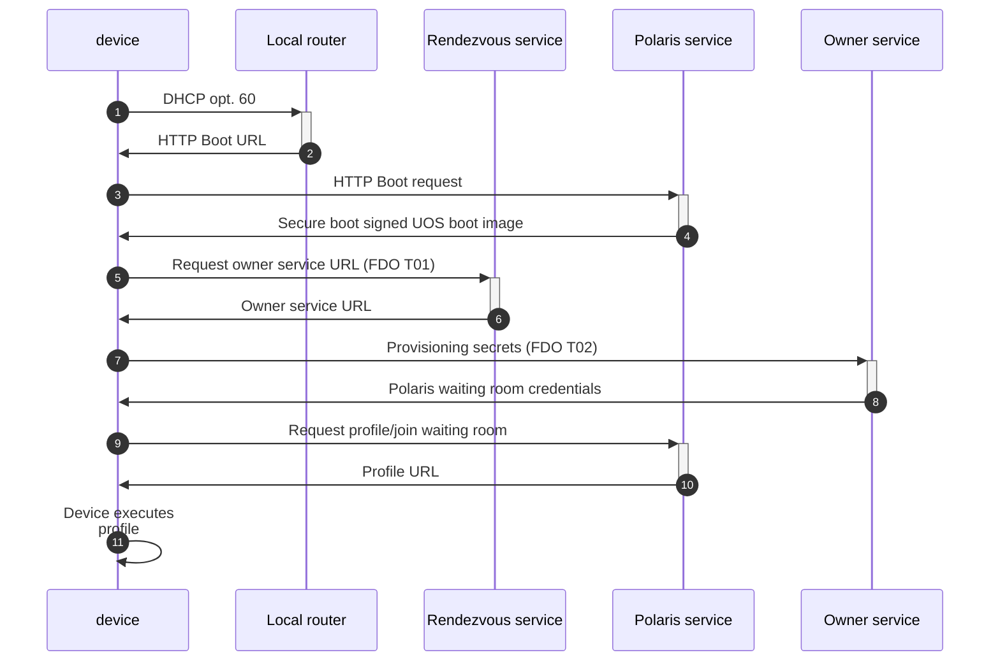

# Polaris Bare Metal Edge Provisioning Service

Parameter | Location | Required | Default | Description
--------- | ------- |------- |------- | -----------
Authorization | header | yes | n/a | Access Token in Bearer format signed using symmetric key obtained through device onboarding
org_id | URL | yes | n/a | Organization ID obtained through device onboarding
device_id | Authorization header | yes | n/a | Device ID obtained through device onboarding
